# .NET Static Analysis DotnetStaticAnalysisMcp.Server

A powerful Model Context Protocol (MCP) server that provides real-time static analysis for .NET solutions. This server integrates with MCP-compatible chat clients to offer comprehensive code analysis, compilation error detection, and project insights directly within your conversation interface.

## Features


### Core Analysis Capabilities
- **🔍 Solution Analysis**: Load and analyze entire .NET solutions with detailed project information
- **⚠️ Compilation Error Detection**: Identify compilation errors with precise line and column locations
- **📊 Project Insights**: Get comprehensive project metadata, dependencies, and source file information
- **🛠️ Diagnostic Tools**: Environment and MSBuild status checking for troubleshooting
- **📝 Structured Logging**: Comprehensive logging with JSON format for debugging and monitoring
- **🔄 Real-time Updates**: Hot reload support during development with `dotnet watch`

### Advanced Type Analysis & Refactoring Support
- **🔍 Type Usage Discovery**: Find all references to types across the entire solution
- **🔗 Member Usage Analysis**: Track method, property, field, and event usage
- **📋 Dependency Analysis**: Understand type dependencies and relationships
- **🔧 Safe Refactoring Validation**: Check rename safety and preview impacts
- **⚡ Impact Scope Analysis**: Analyze potential breaking changes before modifications
- **🎯 Cross-Project Analysis**: Handle references across multiple projects in a solution
## Quick Start

### Prerequisites

- .NET 9.0 SDK or later
- An MCP-compatible chat client (Claude Desktop, Cline, etc.)

### Installation

1. **Clone the repository**:
   ```bash
   git clone <repository-url>
   cd MCP
   ```

2. **Build the server**:
   ```bash
   dotnet build DotnetStaticAnalysisMcp.Server
   ```

3. **Configure your MCP client** by adding this to your MCP configuration file:

   **For Development (with hot reload)**:
   ```json
   {
     "mcpServers": {
       "dotnet-analysis": {
         "command": "dotnet",
         "args": ["watch", "run", "--project", "/path/to/MCP/DotnetStaticAnalysisMcp.Server"],
         "env": {}
       }
     }
   }
   ```

   **For Production**:
   ```json
   {
     "mcpServers": {
       "dotnet-analysis": {
         "command": "dotnet",
         "args": ["run", "--project", "/path/to/MCP/DotnetStaticAnalysisMcp.Server"],
         "env": {}
       }
     }
   }
   ```

4. **Restart your MCP client** to load the server

## Usage

Once configured, you can use these commands in your MCP-compatible chat:

### Core Analysis Commands

#### Load a Solution
```
Load the solution at /path/to/your/solution.sln
```
Uses the `load_solution` tool to analyze a .NET solution file.

#### Get Solution Information
```
Show me the structure of the loaded solution
```
Uses the `get_solution_info` tool to display projects, dependencies, and metadata.

#### Check for Compilation Errors
```
Are there any compilation errors in the current solution?
```
Uses the `get_compilation_errors` tool to find and report all compilation issues.

#### Analyze Specific Files
```
Analyze the file Program.cs for errors
```
Uses the `analyze_file` tool to check a specific file for compilation issues.

### Diagnostic Commands

#### Check Server Status
```
What's the current status of the .NET analysis server?
```
Uses diagnostic tools to show server health, MSBuild status, and environment information.

#### Get Code Suggestions
```
Give me code improvement suggestions for performance and style
```
Uses the `get_code_suggestions` tool to provide AI-powered code improvements.

## Available MCP Tools

| Tool | Description | Parameters |
|------|-------------|------------|
| `load_solution` | Load a .NET solution file | `solutionPath` (string) |
| `get_solution_info` | Get detailed solution structure | None |
| `get_compilation_errors` | Find compilation errors and warnings | None |
| `analyze_file` | Analyze a specific file | `filePath` (string) |
| `get_code_suggestions` | Get AI-powered code improvements | `categories`, `minimumPriority`, `maxSuggestions` |
| `get_suggestion_categories` | List available suggestion categories | None |
| `get_server_version` | Get server version and build info | None |
| `get_basic_diagnostics` | Get environment diagnostics | None |

### Type Analysis & Refactoring Tools
| Tool | Description | Parameters |
|------|-------------|------------|
| `find_type_usages` | Find all references to a specific type | `typeName`, `includeDocumentation`, `maxResults` |
| `find_member_usages` | Find all references to type members | `typeName`, `memberName` |
| `find_namespace_usages` | Find namespace usage and imports | `namespaceName` |
| `get_type_dependencies` | Get types that a type depends on | `typeName` |
| `get_type_dependents` | Get types that depend on a type | `typeName` |
| `analyze_impact_scope` | Analyze potential impact of changes | `typeName` |
| `validate_rename_safety` | Check if rename would cause conflicts | `currentName`, `proposedName` |
| `preview_rename_impact` | Preview files affected by rename | `currentName`, `proposedName` |
| `get_type_analysis_summary` | Complete type analysis report | `typeName` |

## Configuration Files

### MCP Client Configuration Locations

- **Claude Desktop**: `~/.config/claude/claude_desktop_config.json`
- **Cline**: Usually in VS Code settings or `.cline/config.json`
- **Other MCP clients**: Check their documentation

### Example Complete Configuration

```json
{
  "mcpServers": {
    "dotnet-analysis": {
      "command": "dotnet",
      "args": ["watch", "run", "--project", "/home/user/projects/MCP/DotnetStaticAnalysisMcp.Server"],
      "env": {
        "DOTNET_CLI_TELEMETRY_OPTOUT": "1"
      }
    }
  }
}
```

## Logging and Debugging

The server provides comprehensive logging for troubleshooting:

### Log Files
- **Structured logs**: `~/.mcp/logs/dotnet-analysis*.log` (JSON format)
- **Debug logs**: `/tmp/mcp-debug-*.log` (simple text format)

### Viewing Logs
```bash
# View recent structured logs
tail -f ~/.mcp/logs/dotnet-analysis$(date +%Y%m%d).log | jq

# View debug logs
tail -f /tmp/mcp-debug-$(date +%Y%m%d).log
```

### Common Issues

#### Server Not Starting
1. Check that .NET 9.0 SDK is installed: `dotnet --version`
2. Verify the project path in your MCP configuration
3. Check MCP client logs for error messages

#### No Projects Detected
1. Ensure the solution file exists and is valid
2. Check that MSBuild is properly installed
3. Use the diagnostic tools to check MSBuild status

#### Compilation Errors Not Found
1. Verify the solution loads successfully first
2. Check that the projects use supported .NET versions
3. Ensure all NuGet packages are restored: `dotnet restore`

## Development

### Project Structure
```
MCP/
├── DotnetStaticAnalysisMcp.Server/              # Main MCP server application
│   ├── Models/              # Data models for analysis results
│   ├── Services/            # Core analysis and MCP services
│   └── Program.cs           # Server entry point
├── MCP.Tests/               # Unit and integration tests
├── MCP.IntegrationTests/    # Integration tests
├── MCP.TestProject/         # Test project with deliberate errors
└── README.md               # This file
```

### Building from Source
```bash
# Restore dependencies
dotnet restore

# Build all projects
dotnet build

# Run tests
dotnet test

# Run the server locally
dotnet run --project DotnetStaticAnalysisMcp.Server
```

### Running Tests
```bash
# Run all tests
dotnet test

# Run specific test project
dotnet test MCP.IntegrationTests

# Run with verbose output
dotnet test --verbosity normal
```

## Contributing

1. Fork the repository
2. Create a feature branch: `git checkout -b feature/amazing-feature`
3. Make your changes and add tests
4. Ensure all tests pass: `dotnet test`
5. Commit your changes: `git commit -m 'Add amazing feature'`
6. Push to the branch: `git push origin feature/amazing-feature`
7. Open a Pull Request

## License

This project is licensed under the MIT License - see the [LICENSE](LICENSE) file for details.

## Support

- **Issues**: Report bugs and request features on GitHub Issues
- **Discussions**: Join the conversation in GitHub Discussions
- **Documentation**: Check the wiki for additional documentation

## Example Usage Scenarios

### Scenario 1: Code Review Assistant
```
Load the solution at /home/user/MyProject/MyProject.sln and check for any compilation errors. Then analyze the main Program.cs file and suggest performance improvements.
```

### Scenario 2: Project Health Check
```
What's the current status of the loaded solution? Show me the project structure and any issues that need attention.
```

### Scenario 3: Debugging Build Issues
```
I'm getting build errors. Can you load my solution and tell me exactly what's wrong and where?
```

### Scenario 4: Code Quality Analysis

### Scenario 5: Type Usage Analysis
```
Find all usages of the Customer class and analyze its dependencies to understand the impact of potential changes.
```

### Scenario 6: Safe Refactoring
```
I want to rename the Order class to PurchaseOrder. Check if this is safe and show me what would be affected.
```

### Scenario 7: Dependency Analysis
```
Show me all the types that depend on the ICustomer interface and what types it depends on.
```

### Scenario 8: Member Usage Tracking
```
Find all places where the AddOrder method is called and analyze the impact of changing its signature.
```
```
Give me code suggestions for style and best practices improvements with high priority items first.
```

## Advanced Configuration

### Environment Variables
You can customize the server behavior with environment variables:

```json
{
  "mcpServers": {
    "dotnet-analysis": {
      "command": "dotnet",
      "args": ["run", "--project", "/path/to/MCP/DotnetStaticAnalysisMcp.Server"],
      "env": {
        "DOTNET_CLI_TELEMETRY_OPTOUT": "1",
        "MSBUILD_EXE_PATH": "/custom/path/to/msbuild",
        "DOTNET_ROOT": "/custom/dotnet/root"
      }
    }
  }
}
```

### Performance Tuning
For large solutions, you may want to adjust these settings:

- **Memory**: Increase available memory for the .NET process
- **Timeout**: Adjust solution loading timeouts for very large codebases
- **Logging**: Reduce logging verbosity in production

### Security Considerations
- The server runs with the same permissions as your MCP client
- Only load solutions from trusted sources
- Be cautious when analyzing solutions with custom MSBuild targets

## Troubleshooting Guide

### Problem: "MSBuild not found"
**Solution**: 
1. Install .NET SDK (not just runtime)
2. Ensure `dotnet` is in your PATH
3. Try running `dotnet --info` to verify installation

### Problem: "Solution loads but shows 0 projects"
**Solution**:
1. Check that the solution file is valid
2. Ensure all referenced projects exist
3. Run `dotnet restore` on the solution
4. Check the diagnostic logs for MSBuild errors

### Problem: "Server not responding"
**Solution**:
1. Check MCP client logs for connection errors
2. Verify the server process is running
3. Try restarting the MCP client
4. Check firewall/antivirus blocking the process

### Problem: "Compilation errors not detected"
**Solution**:
1. Ensure the solution loads successfully first
2. Check that projects target supported .NET versions
3. Verify all NuGet packages are restored
4. Try building the solution manually with `dotnet build`

## API Reference

### Response Formats

All MCP tools return JSON responses with this general structure:

```json
{
  "success": true,
  "timestamp": "2024-12-20T15:30:00Z",
  "data": { /* tool-specific data */ }
}
```

### Error Handling

When errors occur, responses include detailed error information:

```json
{
  "success": false,
  "error": "Error message",
  "error_code": "ERROR_CODE",
  "timestamp": "2024-12-20T15:30:00Z",
  "details": { /* additional error context */ }
}
```

## Acknowledgments

- Built with [Roslyn](https://github.com/dotnet/roslyn) for .NET code analysis
- Uses [Model Context Protocol](https://modelcontextprotocol.io/) for chat integration
- Powered by [MSBuild](https://github.com/dotnet/msbuild) for project loading
- Logging provided by [Serilog](https://serilog.net/)
- Testing framework: [xUnit](https://xunit.net/)
## Advanced Type Analysis & Refactoring Support

The .NET Static Analysis DotnetStaticAnalysisMcp.Server now includes comprehensive type usage analysis and refactoring support, enabling AI agents to safely perform complex code transformations with full understanding of codebase structure and dependencies.

### 🔍 Type Usage Discovery Tools

#### `find_type_usages` - Find All Type References
Find all references to a specific type (class, interface, struct, enum) across the entire solution.

**Parameters:**
- `typeName` (string): The name of the type to find (e.g., 'Customer' or 'MyNamespace.Customer')
- `includeDocumentation` (bool): Include XML documentation references (default: true)
- `maxResults` (int): Maximum number of results to return (default: 100)

**Usage Types Detected:**
- Variable declarations and instantiations
- Method parameters and return types
- Generic type arguments
- Base classes and implemented interfaces
- Attribute usage
- Cast operations and type checks
- Using directives
- XML documentation references

**Example:**
```bash
find_type_usages typeName="Customer" includeDocumentation=true maxResults=50
```

#### `find_member_usages` - Find Member References
Find all references to specific type members (methods, properties, fields, events).

**Parameters:**
- `typeName` (string): The containing type name
- `memberName` (string): The member name to find

**Member Usage Types:**
- Method calls and property access
- Field access and assignments
- Event subscriptions/unsubscriptions
- Method overrides and implementations

**Example:**
```bash
find_member_usages typeName="Customer" memberName="AddOrder"
```

#### `find_namespace_usages` - Find Namespace References
Find all using statements and fully qualified references to a namespace.

**Parameters:**
- `namespaceName` (string): The namespace to find (e.g., 'System.Collections.Generic')

**Example:**
```bash
find_namespace_usages namespaceName="MyProject.Models"
```

### 📊 Dependency Analysis Tools

#### `get_type_dependencies` - Analyze Type Dependencies
Get all types that a specific type depends on.

**Dependency Types Analyzed:**
- Inheritance relationships (base classes)
- Interface implementations
- Composition relationships (properties, fields)
- Method parameter dependencies
- Generic constraints
- Attribute dependencies

**Example:**
```bash
get_type_dependencies typeName="Customer"
```

#### `get_type_dependents` - Reverse Dependency Analysis
Get all types that depend on a specific type.

**Example:**
```bash
get_type_dependents typeName="Customer"
```

### ⚡ Impact Analysis Tools

#### `analyze_impact_scope` - Analyze Change Impact
Analyze the potential impact of changing a type (what would break).

**Impact Scopes:**
- `None`: No usages found
- `SameFile`: Impact limited to single file
- `SameProject`: Impact within one project
- `MultipleProjects`: Impact across multiple projects
- `EntireSolution`: Solution-wide impact

**Provides:**
- List of affected projects
- Potential breaking changes
- Recommendations for safe changes

**Example:**
```bash
analyze_impact_scope typeName="Customer"
```

### 🔧 Safe Refactoring Validation Tools

#### `validate_rename_safety` - Check Rename Safety
Check if renaming a type/member would cause conflicts or breaking changes.

**Parameters:**
- `currentName` (string): Current name of the type
- `proposedName` (string): Proposed new name

**Validates:**
- Name conflicts with existing types
- Accessibility constraints
- Cross-project impacts

**Example:**
```bash
validate_rename_safety currentName="Customer" proposedName="CustomerEntity"
```

#### `preview_rename_impact` - Preview Rename Changes
Show exactly what files and lines would be affected by a rename operation.

**Provides:**
- Precise file locations (path, line, column)
- Code snippets showing context
- Project-by-project breakdown

**Example:**
```bash
preview_rename_impact currentName="Customer" proposedName="CustomerEntity"
```

### 🎯 Comprehensive Analysis Tool

#### `get_type_analysis_summary` - Complete Type Analysis
Get comprehensive type analysis information including usages, dependencies, and impact in a single call.

**Includes:**
- All type usages across the solution
- Dependency analysis (both directions)
- Impact scope assessment
- Summary statistics

**Example:**
```bash
get_type_analysis_summary typeName="Customer"
```

## Type Analysis Response Format

### TypeUsageReference
```json
{
  "filePath": "/path/to/file.cs",
  "projectName": "MyProject",
  "startLine": 15,
  "startColumn": 8,
  "endLine": 15,
  "endColumn": 16,
  "usageKind": "Declaration",
  "context": "Class: CustomerService",
  "codeSnippet": "Customer customer = new Customer();",
  "containingMember": "CreateCustomer",
  "containingType": "CustomerService"
}
```

### Usage Kinds
- `Declaration`: Type declaration (class, interface, etc.)
- `Instantiation`: Object creation (`new Customer()`)
- `MethodParameter`: Method parameter type
- `MethodReturnType`: Method return type
- `PropertyType`: Property type declaration
- `FieldType`: Field type declaration
- `GenericTypeArgument`: Generic type parameter
- `BaseClass`: Inheritance relationship
- `ImplementedInterface`: Interface implementation
- `AttributeUsage`: Attribute application
- `CastOperation`: Type casting
- `TypeOfExpression`: `typeof(Customer)`
- `IsExpression`: `obj is Customer`
- `AsExpression`: `obj as Customer`
- `UsingDirective`: `using MyNamespace;`
- `XmlDocumentation`: XML doc references

### Dependency Analysis Response
```json
{
  "success": true,
  "analyzedType": "Customer",
  "dependencies": [
    {
      "dependentType": "Customer",
      "dependencyType": "Address",
      "kind": "Composition",
      "context": "Property: Address"
    }
  ],
  "totalDependencies": 5,
  "totalDependents": 3
}
```

## Advanced Usage Examples

### Scenario 1: Safe Type Renaming
```bash
# 1. Check if rename is safe
validate_rename_safety currentName="Customer" proposedName="ClientEntity"

# 2. Preview the impact
preview_rename_impact currentName="Customer" proposedName="ClientEntity"

# 3. Analyze full scope
analyze_impact_scope typeName="Customer"
```

### Scenario 2: Understanding Type Dependencies
```bash
# 1. Get complete analysis
get_type_analysis_summary typeName="Order"

# 2. Find what depends on Order
get_type_dependents typeName="Order"

# 3. Find what Order depends on
get_type_dependencies typeName="Order"
```

### Scenario 3: Refactoring Preparation
```bash
# 1. Find all usages of a method
find_member_usages typeName="Customer" memberName="CalculateTotal"

# 2. Analyze impact of changing the method
analyze_impact_scope typeName="Customer"

# 3. Check namespace usage
find_namespace_usages namespaceName="MyProject.Services"
```

## Technical Implementation

### Roslyn Integration
- Uses Microsoft.CodeAnalysis for semantic analysis
- Leverages SymbolFinder for accurate reference detection
- Supports cross-project analysis within solutions
- Handles generic types, nested types, and partial classes

### Performance Optimizations
- Efficient symbol lookup and caching
- Configurable result limits
- Parallel analysis across projects
- Memory-efficient reference tracking

### Error Handling
- Graceful handling of missing types
- Clear error messages for invalid operations
- Robust handling of partially compiled solutions
- Comprehensive logging for debugging
## Type Analysis Architecture Diagram


## Type Usage Analysis Flow


## Dependency Analysis Visualization


## Refactoring Safety Analysis

```mermaid
flowchart TD
    A[Rename Request: Customer → ClientEntity] --> B{Type Exists?}
    B -->|Yes| C[❌ Conflict Detected]
    B -->|No| D[Find All Usages]
    D --> E[Analyze Usage Contexts]
    E --> F{Cross-Project Impact?}
    F -->|Yes| G[⚠️ Multi-Project Impact]
    F -->|No| H[✅ Safe to Rename]
    G --> I[Generate Warnings]
    H --> J[Generate Preview]
    C --> K[Return Conflicts]
    I --> L[Return Impact Analysis]
    J --> L
    K --> L
    L --> M[Present to AI Agent]
```


